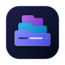

# PackTabs Extension 

> **Save open tabs for unfinished tasks in one click, banish bookmark clutter, and restore your workspace instantly.**

[](https://github.com/topos-lab/packtabs-extension/actions/workflows/ci.yml)
[](https://github.com/topos-lab/packtabs-extension/releases)
[](https://github.com/topos-lab/packtabs-extension/security/dependabot)
[](LICENSE)
[](https://developer.chrome.com/docs/extensions/mv3/intro/)
[](https://wxt.dev/)
[](https://vuejs.org/)
[](https://tailwindcss.com/)
[](https://www.typescriptlang.org/)
[](https://bun.sh/)
[](https://vitest.dev/)
[](https://makeapullrequest.com)

PackTabs is a productivity-first Chrome Manifest V3 browser extension built with the WXT Framework, Vue 3, and Tailwind CSS v4.

## 📥 Installation

Install directly from your preferred browser extension store:

| Browser | Store Link | Status |
| :--- | :--- | :--- |
| **Google Chrome / Chromium** | [Chrome Web Store](https://chromewebstore.google.com/detail/packtabs/mpjjbfgjjbphemiklfoojlogcmjdkjjp) | ✅ Available |
| **Mozilla Firefox** | [Firefox Add-ons (AMO)](https://addons.mozilla.org/zh-CN/firefox/addon/packtabs-task-tab-manager/) | ✅ Available |
| **Microsoft Edge** | Available via Chrome Web Store | ✅ Compatible |

> 💡 **Tip**: After installation, click the puzzle piece icon (🧩) in your browser toolbar and pin **PackTabs** () for instant one-click access!

> 📘 **User Guides**: [English User Guide](docs/USER_GUIDE.md) | [中文使用指南](docs/USER_GUIDE_ZH.md)

When working on multitasking projects, research topics, or troubleshooting issues, tabs easily pile up. Bookmarking them one by one is tedious, slow, and clutters your permanent browser bookmarks with temporary links. PackTabs eliminates this friction: package all open tabs from an unfinished task into an organized group in one click, cleanly close the window to clear your mind and free browser memory, and restore your entire work context whenever you're ready to pick up where you left off.

## Why PackTabs?

- ⚡ **Task-Oriented Session Capture**: Staging and saving 10+ open tabs takes just one click—no more tedious one-by-one bookmarking.
- 🧹 **Instant Focus & Memory Relief**: Save current tabs and close the window automatically to eliminate multitasking clutter and free up system RAM.
- 🚀 **One-Click Workspace Restoration**: Reopen entire task sessions with a single click, or peek into individual links in the background with `Ctrl/Cmd/Shift+Click`.
- 🛡️ **Zero-Loss History Snapshots**: Closed a window or quit the browser unexpectedly? Open sessions are automatically captured as history snapshots so your context is never lost.
- 🎯 **Flexible Drag & Drop Categorization**: Move or organize tabs across task groups effortlessly on the sidebar.

## Core Features

- **One-Click Session Capture**: Save all open tabs in the current window with optional window closing.
- **Smart Auto-Naming**: Intelligent timestamps (e.g. `Tab Group · Oct 2, 20:30`) if no group name is provided.
- **Automatic History Snapshots**: Silently captures tabs before browser or window closing to prevent data loss.
- **Drag-and-Drop Categorization**: Drag any tab from Current Tabs or saved groups into other groups on the sidebar.
- **Background Tab Opening**: Hold `Ctrl`, `Cmd`, or `Shift` and click any tab item to open it silently in the background without switching tabs.
- **Tri-State Theme System**: Seamless toggle between Light, Dark, and Auto (System) themes using Tailwind Zinc palette (Shadcn UI style).
- **Accessible & Lightweight UI**: Headless accessible primitives powered by Radix Vue and styled with pure Tailwind CSS v4 (no bulky UI frameworks).
- **Theme-Adaptive Tooltips**: Custom accessible tooltips supporting multi-line formatting without native OS black tooltip bubbles.
- **Configurable Shortcut**: Quick launcher configurable via Chrome settings (default: `Alt+Shift+K` on Windows/Linux, `Command+Shift+K` on macOS).
- **Robust Storage Architecture**: Sharded storage under `local:tabGroups` bypassing Chrome Sync's 8KB quota, paired with `sync:settings` for cross-device preferences.

## Technology Stack

- **Extension Framework**: [WXT Framework](https://wxt.dev/) (v0.21.x) with Vite 8 bundler
- **Frontend Stack**: [Vue 3](https://vuejs.org/) (Composition API with `<script setup>`), [Pinia 4](https://pinia.vuejs.org/)
- **Styling & UI Primitives**: [Tailwind CSS v4](https://tailwindcss.com/), [Radix Vue](https://www.radix-vue.com/), [Lucide Vue Next](https://lucide.dev/)
- **Language**: [TypeScript](https://www.typescriptlang.org/) (Strict mode)
- **Runtime & Package Manager**: [Bun](https://bun.sh/)
- **Testing**: [Vitest](https://vitest.dev/), [@vue/test-utils](https://test-utils.vuejs.org/), [fast-check](https://fast-check.dev/) (Property-based testing)

## Development

### Prerequisites

- [Bun](https://bun.sh/) (v1.1+)
- Chrome or Chromium-based browser for testing

### Setup

```bash
# Install dependencies
bun install

# Prepare WXT environment
bun run postinstall
```

### Common Commands

```bash
# Start development server with HMR for Chrome
bun run dev

# Start development server for Firefox
bun run dev:firefox

# Build production extension for Chrome MV3
bun run build

# Build production extension for Firefox
bun run build:firefox

# TypeScript type check (no emit)
bun run compile

# Run full test suite (234 unit and property tests)
bun run test

# Package extensions into release zips (.output/*.zip)
bun run zip
bun run zip:firefox

# Code style linting
bun run lint
```

## CI/CD & Automation

This project uses **GitHub Actions** for continuous integration, automated testing, dependency management, and releases:

- **Continuous Integration (`ci.yml`)**:
  - Automatically triggered whenever code is pushed to `main` or upon creating a Pull Request.
  - Installs Bun environment and frozen dependencies.
  - Runs strict TypeScript compilation (`vue-tsc --noEmit`), the complete test suite (234 unit & property-based tests via `vitest`), and builds both Chrome MV3 and Firefox extensions to prevent regressions.
- **Manual Release Pipeline (`release.yml`)**:
  - Manually triggered via GitHub's **Actions** tab (`Run workflow`).
  - Packages production builds for Chrome and Firefox into `.zip` archives.
  - Automatically reads the version from `package.json` (or accepts a custom tag input), creates a GitHub Release, and uploads extension ZIP files directly to the Release page.
- **Dependency Management & Security (`dependabot.yml`)**:
  - Automatically scans npm/bun dependencies weekly and GitHub Actions monthly.
  - Opens automated Pull Requests for security patches and library upgrades.

## Directory Structure

```
packtabs-extension/
├── entrypoints/
│   ├── background.ts              # Service worker (tab capture, snapshot preservation)
│   └── dashboard/                 # Full-page manager application (Vue 3)
│       ├── App.vue                # Main dashboard component
│       ├── main.ts                # App mount entry
│       └── style.css              # Global styles & Tailwind entry
├── components/
│   ├── ui/                        # Reusable accessible UI primitives
│   │   ├── badge/                 # Badge component
│   │   ├── button/                # Button component (cva variants)
│   │   ├── card/                  # Card, CardHeader, CardContent, CardTitle
│   │   ├── dialog/                # Accessible Modal (Radix Vue)
│   │   ├── input/                 # Input component
│   │   ├── toast/                 # ToastContainer component
│   │   └── tooltip/               # Multi-line Tooltip component (Radix Vue)
│   ├── TabGroupCard.vue           # Interactive tab group card
│   ├── TabGroupList.vue           # Timeline-categorized groups list
│   └── CollectionDetail.vue       # Dedicated group detail view
├── stores/
│   └── useTabStore.ts             # Pinia store with optimistic updates & lock-safe storage
├── composables/
│   ├── useTheme.ts                # Tri-state theme manager (light/dark/system)
│   └── useToast.ts                # Floating toast notifications
├── utils/
│   ├── storage.ts                 # Mutex-locked chrome.storage service
│   ├── tabManager.ts              # Browser tabs capture, restore, and favicon service
│   └── init-app.ts                # App initialization
├── types/
│   ├── TabGroup.ts                # Core tab and group models
│   └── Storage.ts                 # Storage schemas and items
└── tests/
    ├── unit/                      # Component and utility unit tests
    └── property/                  # fast-check property-based tests
```

## License

Released under the [MIT License](LICENSE).

## Privacy Policy

PackTabs operates with a 100% offline, privacy-by-default architecture. All saved tab groups and configurations stay strictly inside your local browser storage.  
Read the full [Privacy Policy](PRIVACY_POLICY.md) or visit the hosted version at [https://topos-lab.github.io/packtabs-extension/](https://topos-lab.github.io/packtabs-extension/).
