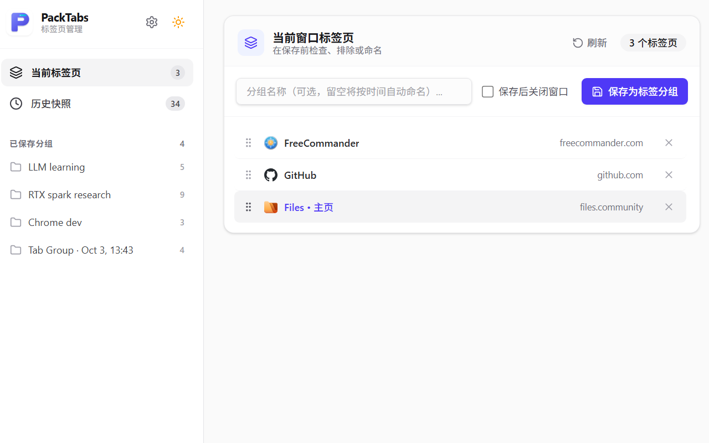
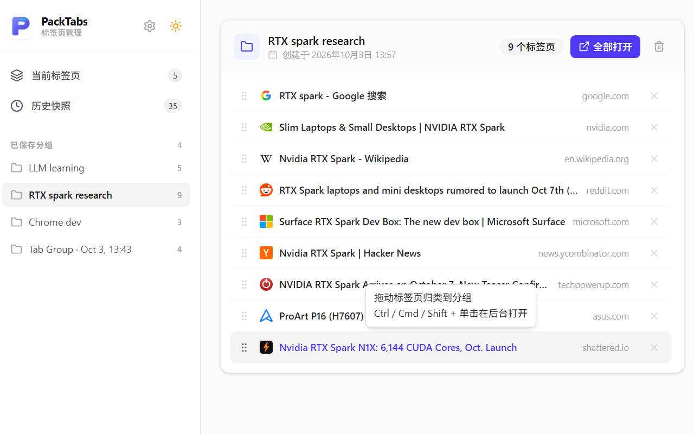
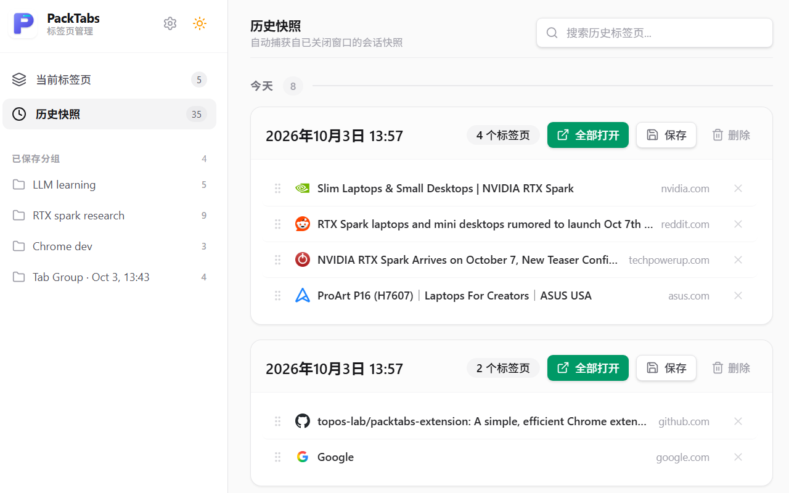
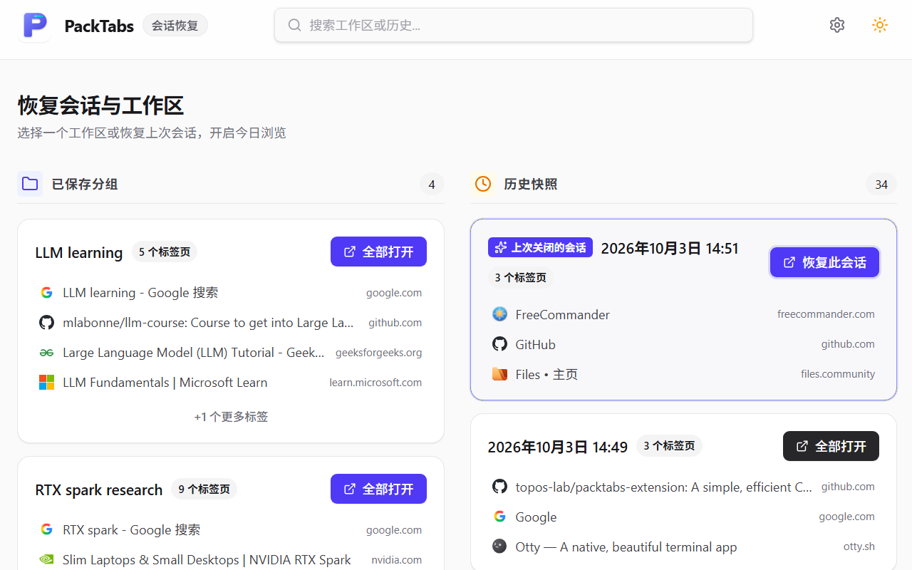
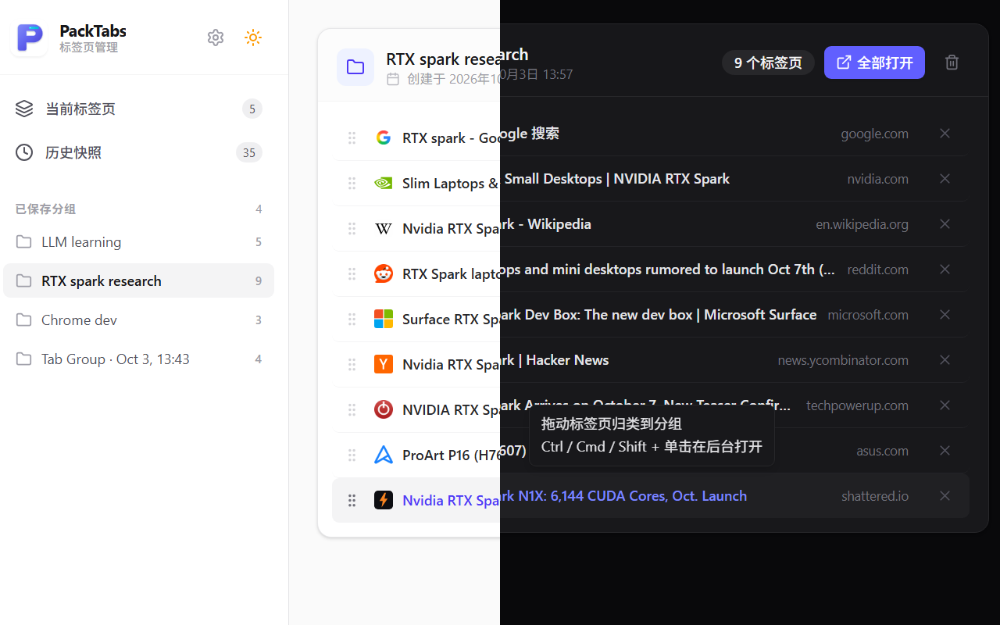

# PackTabs 用户使用指南与功能图解 (User Guide)

🌐 **语言 / Language**: [English](USER_GUIDE.md) | 简体中文

> **版本**：v1.0.0  
> **适用平台**：Google Chrome / Mozilla Firefox / Microsoft Edge 及其他 Chromium 内核浏览器

---

## 一、为什么需要 PackTabs？

在日常工作和研究中，我们常常陷入两种糟糕的体验：
1. **不敢关浏览器**：正在进行的工作/论文调研/项目查阅未完成，浏览器常年挂着 30~80 个标签页，严重占用电脑内存并干扰视线。
2. **书签栏沦为垃圾场**：把临时要看的网页一股脑存入书签栏，过后既难找又舍不得删，导致真正的高频核心书签被严重淹没。

**PackTabs 的解决方案**：
面向**任务（Task-Oriented）**设计的标签页与工作区管理器。做完一个阶段，一键将当前窗口的全部网页打包封存，随时瞬间原样还原；临时任务与永久书签彻底解耦，还你一个干净、专注的工作区。

---

## 二、快速上手 (Quick Start)

### 1. 唤出 PackTabs
- **点击图标**：点击浏览器右上角扩展栏的 **PackTabs** 图标。
- **全局快捷键**：
  - Windows / Linux：`Alt + Shift + K`
  - macOS：`Command + Shift + K`

> [!TIP]
> 如果您想修改快捷键，可在 Chrome 地址栏输入 `chrome://extensions/shortcuts` 进行自定义配置。

---

## 三、六大核心功能指南 (Core Features)

---

### 功能 1：当前窗口检视与一键打包 (Staging & Save)

#### 📖 功能说明
打开 PackTabs 后，首先看到的是【当前窗口标签】视图：
- **实时预览**：列出当前窗口的所有打开标签页，直观显示 Favicon、网页标题和域名。
- **排除单个网页**：在保存前，若有某些不需要的无关网页（如临时搜索引擎主页），悬停点击右侧的 `✕` 即可将其从本次打包中剔除。
- **自定义命名**：在输入框为任务命名（如“LLM learning”、“RTX spark research”）；若留空，系统会自动以当前时间戳（如 `2026-10-03 14:30`）命名。
- **保存并自动关闭**：勾选“保存后关闭窗口”，点击**【保存为标签组】**，即可瞬间清空并关闭当前窗口，释放内存。

*图 1：一键打包当前任务标签页，释放内存，清爽视界*

---

### 功能 2：工作区一键复原与静默打开 (Restore & Tab Operations)

#### 📖 功能说明
在左侧菜单栏切换到【已保存分组】：
- **一键全部恢复**：点击标签组卡片右上角的**【全部打开】**按钮，瞬间在新窗口（或当前窗口）还原当时保存的所有网页。
- **单独打开某页面**：点击卡片中的任意一行网页标题，直接打开该单页。
- **后台静默打开（快捷技巧）**：按住键盘 `Ctrl`（Mac 上为 `Cmd` 或 `Shift`）并点击某个网页，将在后台标签页静默加载，不抢占当前视觉焦点。
- **组内编辑与删除**：双击或点击编辑图标可重命名标签组；点击卡片垃圾桶图标可彻底删除已完成的任务。

*图 2：随时瞬间还原整个任务工作区，支持后台静默打开与标签预览*

---

### 功能 3：自动历史快照 (Automatic History Snapshots)

#### 📖 功能说明
常在河边走，哪能不湿鞋？如果不小心直接点了浏览器右上角大红叉 `✕` 关掉了整个窗口怎么办？
- **自动防丢机制**：PackTabs 内置后台监听服务，当检测到某个窗口关闭时，会**自动将其中所有有效网页捕获为独立的【历史快照】**。
- **从不丢失会话**：在左侧进入【历史快照】列表，按今天、昨天、过去 7 天清晰归档。
- **一键升格为正式组**：在历史快照卡片上点击“保存”，输入名称即可将其转化为永久保存的分组。

*图 3：窗口意外关闭？自动快照完整记录关闭时段标签，一键找回或升格保存*

---

### 功能 4：开机/启动恢复器 (Startup Restorer)

#### 📖 功能说明
每天早晨打开电脑启动浏览器时，快速接着昨晚未做完的任务继续：
- 在设置中开启【启动时打开恢复器】。
- 每次打开全新浏览器时，PackTabs 会自动弹出专属的简洁引导全屏页，清晰列出您上次关闭的会话和高频分组。
- 点击**【恢复此会话】**或**【全部打开】**，无缝衔接上一场工作流。

*图 4：开启浏览器即刻继续未竟任务，无缝切换工作上下文*

---

### 功能 5：直观拖拽归类 (Drag & Drop Stashing)

#### 📖 功能说明
- **自由归类**：鼠标悬停在任意标签行左侧的拖拽手柄（`⋮⋮`）上，按住即可直接拖拽至左侧边栏的指定已有分组中，释放即可完成归类。
- **即时视觉反馈**：拖动时目标分组会自动呈现高亮边框提示，并带有操作 Tooltip 指引。
- **组内调序**：在同一个分组卡片内部拖动标签，可自由上下调整重要度顺序。

---

### 功能 6：深浅色自适应与 100% 离线隐私 (Theme & Privacy)

#### 📖 功能说明
- **主题自适应切换**：点击右上角太阳/月亮图标，支持【明亮 / 暗黑 / 跟随系统】三态切换。精心打磨的 Tailwind Zinc 色阶在夜间模式下极其护眼舒适。
- **100% 离线运行与本地安全**：所有网页标题、地址全部保存在您本机浏览器的 10MB 独立沙箱中，零网络请求、零第三方追踪。

*图 5：明亮与暗黑护眼模式双向无缝切换，界面纯净舒适*

---

## 四、如何制作符合应用商店规范的 1280×800 截图？

Chrome Web Store 与 Firefox AMO 严格要求宣传截图尺寸为 **1280×800** 或 **640×400**。

### 快捷截取步骤（利用 Chrome DevTools 获得点对点超清画质）：
1. 在 Chrome 中打开 PackTabs 页面（按 `Alt + Shift + K` 或 Mac `Cmd + Shift + K`）。
2. 按 `F12`（Mac `Cmd + Option + I`）打开开发者工具，按 `Ctrl + Shift + M`（Mac `Cmd + Shift + M`）进入**设备模拟模式**。
3. 在顶部尺寸栏输入：宽度 **`1280`**，高度 **`800`**。
4. **设置像素比 (DPR)**：点击设备工具栏右上角的 `⋮` -> 勾选 **Add device pixel ratio**，将 DPR 设为 **`1`**（直接输出 1280×800 原生像素），或设为 **`2`** 并在截取后按比例缩小至 1280×800 获得超采样细腻质感。
5. 按 `Ctrl + Shift + P`（Mac `Cmd + Shift + P`），输入并选择 **Capture screenshot**。
6. 浏览器将自动下载严格为 `1280x800` 且无模糊伪影的高清 PNG 截图，可直接用于上架或文档展示！

---

## 五、常用技巧速查表

| 操作 | 快捷方式 / 操作方法 | 作用 |
| :--- | :--- | :--- |
| **打开/切换管理面板** | `Alt + Shift + K` (Mac: `Cmd + Shift + K`) | 快速唤出仪表盘，若已打开则直接聚焦 |
| **刷新当前窗口标签** | 打开面板状态下再按一次 `Alt + Shift + K` 或点击刷新 | 重新扫描当前窗口变动的标签页 |
| **后台静默打开网页** | 按住 `Ctrl` / `Cmd` / `Shift` 点击标签 | 不切换焦点，在后台加载网页 |
| **快速重命名分组** | 双击分组卡片标题 或 点击编辑按钮 | 修改任务组名称 |
| **单页剔除** | 悬停标签行点击右侧 `✕` | 不保存该页或从组中移除 |
