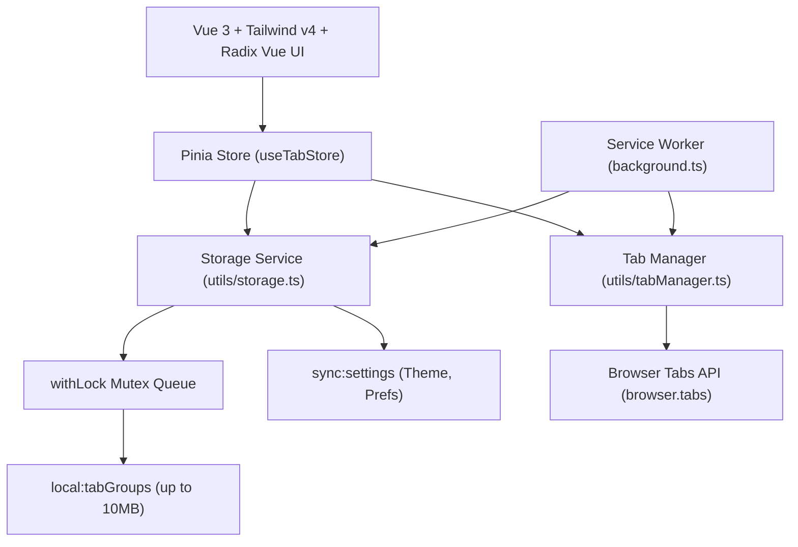

# Design Document: Tab Group Manager

## Overview

PackTabs is a Chrome Manifest V3 extension that provides efficient tab group management through a modern, lightweight Vue 3 interface. Built with the WXT Framework, Tailwind CSS v4, and Radix Vue, the system follows a clean architecture pattern with clear separation between the extension service worker layer, the mutex-locked persistence layer (`local:tabGroups` & `sync:settings`), and the presentation layer. The design emphasizes high performance, tree-shakeable headless accessibility, zero heavy UI suites, and elegant aesthetics.

## Technology Stack

- **[WXT Framework](https://wxt.dev/)**: Modern web extension development framework providing type-safe unified `browser.*` APIs, hot module reloading, and Vite 8 bundler.
- **[Vue 3](https://vuejs.org/)**: Progressive JavaScript framework with Composition API (`<script setup>`) for reactive, maintainable UI components.
- **[Tailwind CSS v4](https://tailwindcss.com/)**: Cutting-edge CSS engine with modern `@theme` support, custom `.dark` variants, and the professional `zinc` palette (Shadcn UI standard).
- **[Radix Vue](https://www.radix-vue.com/)**: Headless, accessible primitives (`DialogRoot`, `TooltipRoot`, `Portal`, etc.) ensuring full WAI-ARIA compliance, focus trapping, and keyboard navigation.
- **[Lucide Vue Next](https://lucide.dev/)**: Lightweight, tree-shakeable SVG icons (`SunMoon`, `GripVertical`, `Layers`, `Clock`, `Folder`, `Trash2`, etc.).
- **[TypeScript](https://www.typescriptlang.org/)**: Strict type-safe development across models, storage schemas, and component props.
- **[Manifest V3](https://developer.chrome.com/docs/extensions/develop/migrate/what-is-mv3)**: Chrome extension manifest version utilizing service workers and promise-based storage.
- **[Pinia 4](https://pinia.vuejs.org/)**: Centralized reactive state management with optimistic UI updates and error boundaries.
- **[Bun](https://bun.sh/)**: High-speed JavaScript runtime and package manager.
- **[Vitest 5](https://vitest.dev/)** & **[fast-check](https://fast-check.dev/)**: Comprehensive testing with 190+ unit and property-based tests.

## Project Structure

```
packtabs-extension/
├── entrypoints/
│   ├── background.ts              # Service worker (tab capture, snapshot preservation)
│   └── dashboard/                 # Management page
│       ├── App.vue                # Main dashboard shell & layout
│       ├── main.ts                # App initialization
│       └── style.css              # Global styles & Tailwind v4 theme setup
├── components/
│   ├── ui/                        # Reusable accessible UI primitives
│   │   ├── badge/                 # Badge component (cva variants)
│   │   ├── button/                # Button component (cva variants)
│   │   ├── card/                  # Card, CardHeader, CardContent, CardTitle
│   │   ├── dialog/                # Accessible Modal (Radix Vue Dialog)
│   │   ├── input/                 # Input component
│   │   ├── toast/                 # ToastContainer component
│   │   └── tooltip/               # Multi-line Tooltip component (Radix Vue Tooltip)
│   ├── TabGroupCard.vue           # Interactive tab group card
│   ├── TabGroupList.vue           # List container grouped by time categories
│   └── CollectionDetail.vue       # Dedicated group detail view
├── stores/
│   └── useTabStore.ts             # Pinia store for tab groups & optimistic updates
├── composables/
│   ├── useTheme.ts                # Tri-state theme manager (light/dark/system)
│   └── useToast.ts                # Floating toast notifications
├── utils/
│   ├── storage.ts                 # Mutex-locked WXT storage service
│   ├── tabManager.ts              # Tab operations & MV3 favicon service
│   └── init-app.ts                # Vue app bootstrap utility
├── types/
│   ├── TabGroup.ts                # TypeScript domain models
│   └── Storage.ts                 # WXT storage schemas & keys
├── tests/
│   ├── unit/                      # Component & utility unit tests
│   └── property/                  # fast-check property-based tests
├── public/
│   └── icon/                      # Extension icons
├── wxt.config.ts                  # WXT configuration
├── tsconfig.json                  # TypeScript configuration
└── package.json                   # Dependencies and scripts
```

## System Architecture



### 1. Presentation Layer

- **Layout**: Permanent two-pane dashboard layout (`w-64` sidebar + flexible main workspace).
- **Staging View**: Current window tabs staged for review, exclusion, and naming before saving.
- **Timeline Organization**: History Snapshots categorized into relative time buckets (Today, Yesterday, Previous 7 Days, This Month, Older).
- **Headless UI Primitives**: Built on Radix Vue (`Modal.vue`, `Tooltip.vue`), styled with Tailwind utility classes.

### 2. State & Business Logic Layer

- **Pinia Store (`useTabStore`)**:
  - Manages active tab groups, history groups, and selected view navigation.
  - Implements optimistic UI updates for instant drag-and-drop feedback and deletion, rolling back on storage failures.
  - Provides a centralized error handling hook (`setStoreErrorHandler`) triggering accessible toast notifications.

### 3. Storage & Concurrency Layer

- **Storage Segregation**:
  - `local:tabGroups`: Persists all tab groups in Chrome Local Storage, eliminating the 8KB per-item quota limit imposed by Chrome Sync Storage.
  - `sync:settings`: Persists lightweight user preferences (`theme`, `autoCloseAfterSave`) in Chrome Sync Storage for cross-device synchronization.
- **Mutex Serialization (`withLock`)**:
  - Guarantees sequential write execution to prevent race conditions during rapid tab operations or background snapshot saves.
- **Immutability**:
  - All write and update operations clone data using `structuredClone` to prevent memory reference leaks.

### 4. Tab & Favicon Management Layer

- **MV3 Favicon Access**:
  - Uses the Manifest V3 compliant internal URL:
    `chrome-extension://${browser.runtime.id}/_favicon/?pageUrl=${encodeURIComponent(url)}&size=32`
  - Gracefully falls back to a neutral `Globe` icon on load errors.
- **Background Silent Opening**:
  - When holding `Ctrl`, `Cmd`, or `Shift` and clicking any tab item, calls `browser.tabs.create({ url, active: false })` to restore tabs in the background without switching context.
- **Drag-and-Drop Categorization**:
  - Uses custom MIME type `application/packtabs-tab` carrying JSON payloads.
  - Customizes `text/plain` to prevent Chrome's native Split View / Side-by-side mode from hijacking the drop.
  - Displays standard `cursor-move` (✥) across the entire tab row on both Windows and macOS.

### 5. Theme & Appearance Layer

- **Tri-State Theme Manager (`useTheme.ts`)**:
  - Supports `system`, `light`, and `dark` modes.
  - Listens to OS `(prefers-color-scheme: dark)` media query when in `system` mode.
  - Uses Tailwind CSS Zinc palette (`bg-white` / `bg-zinc-50` for light, `bg-zinc-900` / `bg-zinc-950` for dark).
- **Theme-Adaptive Multi-Line Tooltips (`Tooltip.vue`)**:
  - Built with Radix Vue Tooltip primitives.
  - Avoids Chrome/Windows native black title tooltips.
  - Renders multi-line hints via newlines `\n`, string arrays `string[]`, or `#content` slots.

### 6. Keyboard Shortcuts & Commands

- **Command Registration**:
  - Configured under `commands._execute_action` in `wxt.config.ts`.
  - Default suggested key: `Alt+Shift+K` on Windows/Linux, `Command+Shift+K` on macOS (avoiding internal browser key collisions).
- **Real-time Querying & Focus Refresh**:
  - Queries active status via `browser.commands.getAll()`.
  - Automatically re-queries when the window gains focus (`window.addEventListener('focus', loadShortcut)`).

### 7. Startup Session Restorer (`components/StartupRestorer.vue`)

- **Dual-Track Restorer Architecture**:
  - Activated conditionally upon browser cold start (`browser.runtime.onStartup`) when `openOnStartup` is enabled in `sync:settings`.
  - Accessed via query parameter `/dashboard.html?mode=startup` to share build chunks and provide instant transition to the main dashboard.
- **Ergonomic 2-Column Layout**:
  - **Left Column (Saved Groups)**: Displays user-curated project workspaces with tab badges, instant "Open All" action, and individual tab click handlers.
  - **Right Column (History Snapshots)**: Presents chronological session snapshots with visual emphasis (`Last Closed Session` / `⭐ 上次关闭的会话`) for 1-click resumption.
- **Zero-Friction "Click & Go" Interaction**:
  - Completely strips out group deletion, renaming, drag-and-drop, and staging panels.
  - Features real-time multi-column search filtering by group name or tab title/URL.
  - Seamlessly transitions to full management mode via `open-full-dashboard` event.

## Testing Strategy

- **Unit Testing**: Vitest with `@vue/test-utils` for components, stores, utilities, and composables.
- **Property-Based Testing**: `fast-check` validating invariants:
  - Tab group data persistence round-trip
  - Timestamp assignment correctness
  - Group operation isolation
  - Name modification persistence
  - Sidebar content accuracy
- **Test Coverage**: 230 automated tests across 35 test suites maintaining 100% pass rate.
